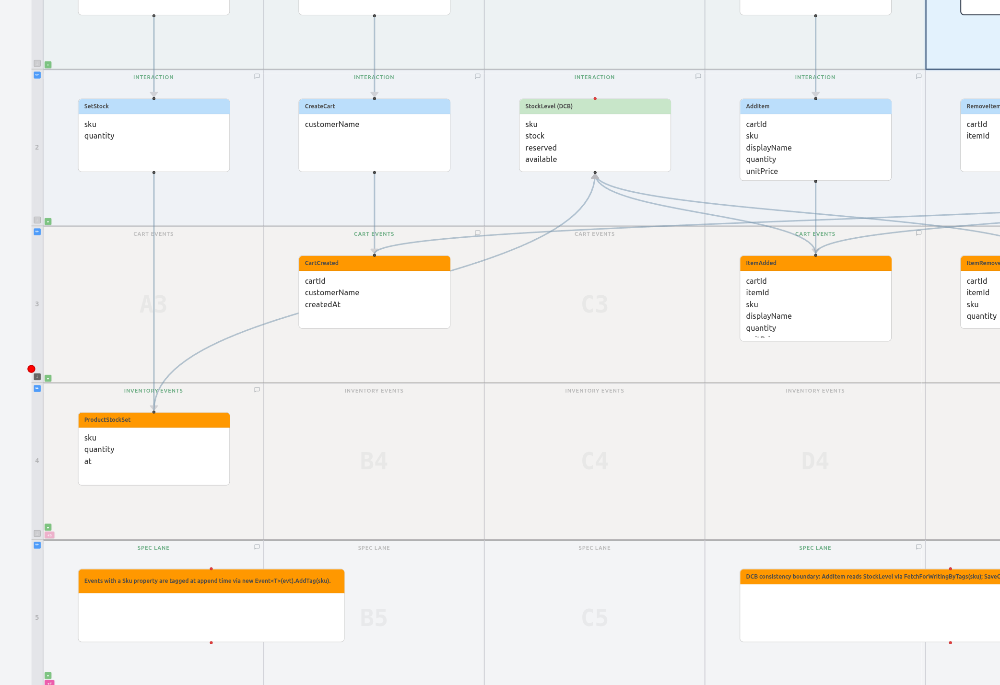

# CartShop

A small, working **DCB (Dynamic Consistency Boundary)** reference, built as a
vertical-slice event-sourced cart on Marten 8 + Wolverine 5 + .NET Aspire +
Angular. Intended as a teaching example: the slices are deliberately thin so
the consistency story is the visible thing.

> 📖 **[Patterns catalog →](docs/PATTERNS.md)** — index of the patterns this
> repo demonstrates (vertical slices, DCB, projection lifecycles, the five
> expensive-projection categories), each linked to the slice that puts it
> to work.

> 🎓 **[Guided walkthrough →](TeachMe.md)** — a nine-step syllabus written
> as instructions to an AI tour guide. Paces itself to your questions,
> quizzes after each step, saves progress between sessions.

## Use the walkthrough with any LLM tool

`TeachMe.md` is plain markdown; any chat-driven coding tool can run it.
The only piece that's editor-specific is *how you point the agent at the
file*:

| Tool | Invocation |
|---|---|
| **Claude Code** | `/teachme` (auto-discovered slash command in `.claude/commands/`) |
| **GitHub Copilot Chat** | The repo ships `.github/copilot-instructions.md` — just say *"teach me this repo"* or *"give me a tour"* in chat |
| **Cursor** | The repo ships `.cursorrules` with the same hint — say *"teach me this repo"* in Composer/Chat |
| **Cline / Continue / Aider / generic terminal agent** | Tell it: *"Read TeachMe.md and follow it as a syllabus to walk me through the codebase."* |
| **Plain ChatGPT / Claude.ai / Gemini (no file system)** | Paste `TeachMe.md` plus a few relevant code files (`README.md`, `Initialization.cs`, one handler) into the chat. Walkthrough works but degrades — the agent can't open files on demand. |

**Progress tracking** (`~/.cartshop-teachme.json`) needs filesystem
access. It works in agent-mode tools (Claude Code, Cursor, Cline, Aider).
In pure chat tools without shell access, the syllabus still runs but
progress lives only in the conversation history.

Stack
- .NET 10
- Marten 8 — event store, inline snapshot projection, DCB tag tables
- WolverineFx 5 — `[WolverinePost|Get|Delete]` HTTP endpoint discovery
- WolverineFx.Marten — transactional outbox
- .NET Aspire 13 — orchestrates Postgres + API + Angular
- Angular 21 — standalone components, signals

## Event model

The Nebulit canvas under [`docs/CartShop_DCB_Inventory-2026-05-14.json`](docs/CartShop_DCB_Inventory-2026-05-14.json)
captures the full flow. Three edge colors carry the consistency story:

- 🔴 **Red, with `!`** — the *gate*. `StockLevel (DCB) → AddItem`,
  `CouponUsage (DCB) → ApplyCoupon`, `OpenCartByCustomer → CreateCart`.
  Read this as: "before the command on the right can write, it must
  consult the view on the left."
- 🟠 **Orange** — events that *feed* a DCB view (their SKU or coupon-code
  tags fold into the view). These participate in the boundary but don't
  gate a specific write themselves.
- 🔵 **Blue** — ordinary projection fan-out, no consistency stake.



Read the diagram top-down per column:

- **Actor row** — who initiates each command.
- **Interaction row** — commands (blue) and read models (green).
- **Cart Events** swimlane — events written to a per-cart stream.
- **Inventory Events** swimlane — `ProductStockSet` lives in its own
  `product-{sku}` stream, in a different swimlane to make the cross-stream
  nature obvious.
- **Spec Lane** — given/when/then scenarios anchored to the command or
  read model they describe.
- **Feedback row** — markdown notes explaining the DCB tag plumbing and
  projection-lifecycle choices.

The interesting node is `StockLevel (DCB)`. It's a *live fold* over every event
tagged with the same SKU, regardless of which stream the event came from:

```
EventTagQuery.For(sku)
  .AndEventsOfType<ProductStockSet, ItemAdded, ItemRemoved, CartSubmitted>()
```

`AddItem` reads it through Marten's DCB boundary, and `SaveChangesAsync` throws
`DcbConcurrencyException` if any other Sku-tagged event lands between the read
and the write.

Compare with `GetCart`: blue edges throughout, because it's a Marten
**inline snapshot** built from a single stream — the stream's own version
number is the consistency boundary, so no cross-stream check is needed.

## Layout

```
CartShop.AppHost/          Aspire orchestrator (Postgres + api + web)
CartShop.ServiceDefaults/  Shared Aspire defaults (OTel, health, discovery)
CartShop.ApiService/       Web host — Program.cs
CartShop.Core/             Vertical slices live here
  Domain/
    CartAggregate.cs       Inline snapshot built from one cart's stream
    InventoryView.cs       Tag-folded live aggregate (DCB)
  Feature/Cart/
    Commands/CreateCart/Handler.cs
    Commands/AddItem/Handler.cs      ← DCB stock check
    Commands/RemoveItem/Handler.cs
    Commands/SubmitCart/Handler.cs
    Queries/GetCart/Handler.cs
    Queries/ListSubmittedCarts/Handler.cs
  Feature/Inventory/
    Commands/SetStock/Handler.cs
    Queries/StockLevel/Handler.cs
  Initialization.cs        Marten + Wolverine + tag-type registration
CartShop.Events/           Plain event records + Sku tag type
cart-shop-web/             Angular SPA with mirrored slice folders
  src/app/feature/
    cart/{commands,queries}/<slice>/<slice>.ts
    inventory/{commands,queries}/<slice>/<slice>.ts
  src/app/app.ts           Pure composition over slice components
```

## Slice pattern

Each slice is a single file: the request/response records colocated with a
static endpoint class. Wolverine.Http discovers the attribute and registers it
as a minimal-API route at startup — no controllers, no DI registration, no
endpoint mapping table.

```csharp
public static class CreateCartEndpoint
{
    [WolverinePost("/api/carts")]
    public static async Task<IResult> Handle(
        CreateCartRequest request,
        IDocumentSession session,
        CancellationToken ct)
    {
        var cartId = Guid.NewGuid();
        var created = new CartCreated(cartId, request.CustomerName, DateTimeOffset.UtcNow);
        session.Events.StartStream<CartAggregate>(cartId, created);
        await session.SaveChangesAsync(ct);
        return Results.Created($"/api/carts/{cartId}", new CreateCartResponse(cartId));
    }
}
```

`CartAggregate` is registered as an inline snapshot projection, so reads use
`session.LoadAsync<CartAggregate>(id)` (cheap document load) and the
"submitted carts" list query is a regular LINQ query against the same
projection document.

The Angular SPA mirrors this layout one-to-one: every backend slice has a
matching `.ts` file under `cart-shop-web/src/app/feature/...`, each owning its
DTOs, HTTP call, template, and styles. The root `App` component is pure
composition — no shared cart service, no global store.

## DCB inventory — the punchline

`Sku` is registered as a Marten tag type:

```csharp
opts.Events.RegisterTagType<Sku>();
```

Events that carry a Sku are explicitly tagged at append time by wrapping them
as `IEvent`:

```csharp
var tagged = new Event<ItemAdded>(evt);
tagged.AddTag(sku);
session.Events.Append(cartId, tagged);
```

`AddItem` reads the inventory through the **DCB boundary** so
`SaveChangesAsync` asserts no other Sku-tagged event slipped in between the
read and the write — across every cart, atomically:

```csharp
var query = EventTagQuery
    .For(sku)
    .AndEventsOfType<ProductStockSet, ItemAdded, ItemRemoved, CartSubmitted>();

IEventBoundary<InventoryView> boundary =
    await session.Events.FetchForWritingByTags<InventoryView>(query, ct);

if (boundary.Aggregate.Available < request.Quantity)
    return Results.BadRequest(...);

session.Events.Append(cartId, tagged);
try   { await session.SaveChangesAsync(ct); }
catch (DcbConcurrencyException) { return Results.Conflict(...); }
```

`InventoryView` is a live fold of `ProductStockSet` / `ItemAdded` /
`ItemRemoved` / `CartSubmitted` across every stream — no per-stream snapshot
needed, and no ad-hoc lock or queue. The consistency comes from the tag
boundary alone.

### Stock vs. Reserved vs. Available

Three numbers, kept honest by the four events that fold into the view:

| Event           | Effect                              |
|-----------------|-------------------------------------|
| `ProductStockSet` | `Stock = n` (physical units on hand) |
| `ItemAdded`       | `Reserved += qty` (held but not sold) |
| `ItemRemoved`     | `Reserved -= qty` (released) |
| `CartSubmitted`   | `Stock -= qty`, `Reserved -= qty` (sold; consumed) |

`Available = Stock − Reserved`. After a submit, `Available` doesn't move —
what changes is *which side of the ledger* the units sit on. `Stock` is
what's physically left; `Reserved` is what's still pending in open carts.

### One event, multiple boundaries

`CartSubmitted` is a single cart-stream event, but a cart can hold many
SKUs. `SubmitCart` tags the event with **every Sku in the cart** at append
time:

```csharp
var tagged = new Event<CartSubmitted>(evt);
foreach (var sku in cart.Lines.Select(l => l.Sku).Distinct())
    tagged.AddTag(sku);
```

Each per-SKU `InventoryView` fold then sees the same event independently
and updates its own state. The tag *is* the consistency boundary; one
event can join more than one.

## Running

```bash
dotnet run --project CartShop.AppHost
```

Aspire spins up:
- `postgres` (with pgAdmin sidecar)
- `cartdb` database
- `api` (.NET 10 API)
- `web` (Angular dev server on port 4200, proxied to `api` for `/api/*`)

The Aspire dashboard prints a URL on startup; the `web` resource link opens
the SPA. First run also needs npm deps:

```bash
cd cart-shop-web && npm install
```

If you prefer Podman to Docker:

```bash
export DOTNET_ASPIRE_CONTAINER_RUNTIME=podman
systemctl --user start podman.socket
```

## API surface

| Verb   | Path                                  | Slice                |
|--------|---------------------------------------|----------------------|
| POST   | `/api/carts`                          | CreateCart           |
| GET    | `/api/carts/{id}`                     | GetCart              |
| POST   | `/api/carts/{id}/items`               | AddItem (DCB)        |
| DELETE | `/api/carts/{id}/items/{itemId}`      | RemoveItem           |
| POST   | `/api/carts/{id}/submit`              | SubmitCart           |
| GET    | `/api/carts/submitted`                | ListSubmittedCarts   |
| GET    | `/api/carts/{id}/timeline`            | CartTimeline (live)  |
| POST   | `/api/carts/{id}/coupon`              | ApplyCoupon (DCB)    |
| POST   | `/api/inventory/{sku}`                | SetStock             |
| GET    | `/api/inventory/{sku}`                | StockLevel           |
| GET    | `/api/reports/sales-by-day`           | SalesByDay (async)   |

`GET /openapi/v1.json` returns the live schema in development.

## End-to-end DCB walk-through

```bash
# Establish stock
curl -X POST localhost:5270/api/inventory/SKU-A -H 'content-type: application/json' \
     -d '{"quantity":10}'

# Cart 1 reserves 8 — OK; available drops to 2
CART1=$(curl -sX POST localhost:5270/api/carts \
        -H 'content-type: application/json' \
        -d '{"customerName":"Alice"}' | jq -r .cartId)
curl -X POST localhost:5270/api/carts/$CART1/items \
     -H 'content-type: application/json' \
     -d '{"sku":"SKU-A","quantity":8,"unitPrice":1.5}'

# Cart 2 tries to reserve 5 — REJECTED (cross-cart, only 2 available)
CART2=$(curl -sX POST localhost:5270/api/carts \
        -H 'content-type: application/json' \
        -d '{"customerName":"Bob"}' | jq -r .cartId)
curl -X POST localhost:5270/api/carts/$CART2/items \
     -H 'content-type: application/json' \
     -d '{"sku":"SKU-A","quantity":5,"unitPrice":1.5}'
# → 400 { "error": "Insufficient stock", "requested": 5, "available": 2 }
```

That rejection is the DCB boundary doing its job: two independent cart streams,
one atomic inventory invariant.

### Concurrent race — the harder case

The walk-through above is *sequential*: Cart 1 finishes before Cart 2 starts. A
plain aggregate could handle that too. The unique value of DCB is the
*simultaneous* case — two requests both read enough stock, both decide to
reserve, and the boundary catches the loser at `SaveChangesAsync` with a
`DcbConcurrencyException` → `409`.

```bash
# Stock exactly 1 unit; race two carts for it.
curl -X POST localhost:5270/api/inventory/SKU-RARE \
     -H 'content-type: application/json' -d '{"quantity":1}'

CART_A=$(curl -sX POST localhost:5270/api/carts \
         -H 'content-type: application/json' \
         -d '{"customerName":"Alice"}' | jq -r .cartId)
CART_B=$(curl -sX POST localhost:5270/api/carts \
         -H 'content-type: application/json' \
         -d '{"customerName":"Bob"}' | jq -r .cartId)

# Fire both in parallel.
curl -sX POST "localhost:5270/api/carts/$CART_A/items" \
     -H 'content-type: application/json' \
     -d '{"sku":"SKU-RARE","quantity":1,"unitPrice":99}' &
curl -sX POST "localhost:5270/api/carts/$CART_B/items" \
     -H 'content-type: application/json' \
     -d '{"sku":"SKU-RARE","quantity":1,"unitPrice":99}' &
wait
# → one 200, one 409 { "error": "Stock changed while reserving; retry." }
```

That 409 is the `catch (DcbConcurrencyException)` arm of `AddItem` firing.
Without DCB, both writes would land and you'd oversell by exactly one.

### Coupon code — DCB on a different shape of rule

Inventory is a *numeric balance* rule. The `ApplyCoupon` slice demonstrates
DCB on a *one-shot* rule: a coupon code can be applied at most once across
every cart in the system.

```bash
# Two carts race the same coupon code.
curl -sX POST "localhost:5270/api/carts/$CART_A/coupon" \
     -H 'content-type: application/json' -d '{"code":"WELCOME10"}' &
curl -sX POST "localhost:5270/api/carts/$CART_B/coupon" \
     -H 'content-type: application/json' -d '{"code":"WELCOME10"}' &
wait
# → one 200, one 409 { "error": "Coupon 'WELCOME10' has already been used" }
```

Same mechanism (`FetchForWritingByTags<CouponUsageView>` → decide → append →
save), different invariant shape. That's the point: DCB is a primitive, not
a single trick.
